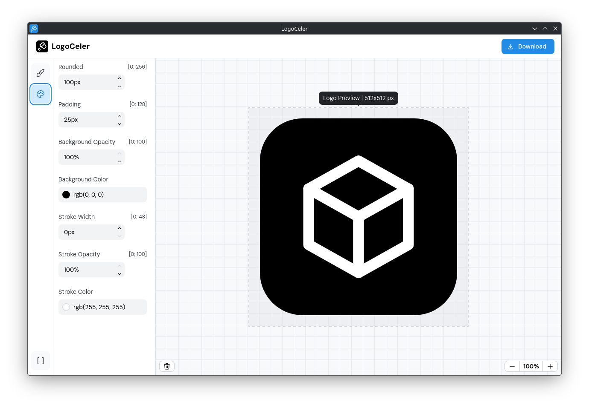

<p align="center">
  
  <h1 align="center">LogoCeler</h1>
  <p align="center">Rapid Logo Creator</p>
</p>



---

## Features

- Over **4,500 icons** to choose from
- Export **SVG** and **PNG**, with **PNG** available in standard logo/icon sizes
- Exports **native SVG** (no **`foreignObject`**) for **compact SVG and PNG** output
- Built with **Tauri**, resulting in a significantly **smaller executable** than Electron-based applications
- **Works offline, too**

---

## Building from Source

### Prerequisites

Before building the application, make sure you have:

- Rust
- Node.js
- npm
- Git
- Tauri prerequisites for your operating system

### How to Build

1. Clone the repository

```bash
git clone https://github.com/mallei/LogoCeler.git
```

2. Enter the project directory

```bash
cd LogoCeler
```

3. Install dependencies

```bash
npm install
```

4. Start the development version

```bash
npm run tauri dev
```

5. Build the production application

```bash
npm run tauri build -- --no-bundle
```

The compiled application will be available in:

```text
src-tauri/target/release
```

For more information about building and distributing Tauri applications, see the [official Tauri documentation](https://v2.tauri.app/distribute/).

---

## Keyboard Shortcuts

| Shortcut                                                       | Action             |
| -------------------------------------------------------------- | ------------------ |
| <kbd>Ctrl</kbd> + <kbd>=</kbd>, <kbd>Ctrl</kbd> + <kbd>+</kbd> | Zoom in            |
| <kbd>Ctrl</kbd> + <kbd>-</kbd>                                 | Zoom out           |
| <kbd>Ctrl</kbd> + <kbd>0</kbd>                                 | Zoom to 100%       |
| <kbd>Ctrl</kbd> + <kbd>1</kbd>                                 | Icon section       |
| <kbd>Ctrl</kbd> + <kbd>2</kbd>                                 | Background section |
| <kbd>Ctrl</kbd> + <kbd>3</kbd>                                 | About section      |
| <kbd>Ctrl</kbd> + <kbd>S</kbd>                                 | Download           |
| <kbd>Ctrl</kbd> + <kbd>Shift</kbd> + <kbd>R</kbd>              | Reset settings     |

---

## Built With

- Tauri
- React
- TypeScript
- Vite
- Mantine UI
- Tabler Icons
- Rust

---

## Contributing

Contributions are always welcome!

- Open an Issue
- Submit a Pull Request
- Suggest new features

---

## License

This project is licensed under the **GNU General Public License v3.0 (GPL-3.0)**.

See the [LICENSE](LICENSE) file for more information.
